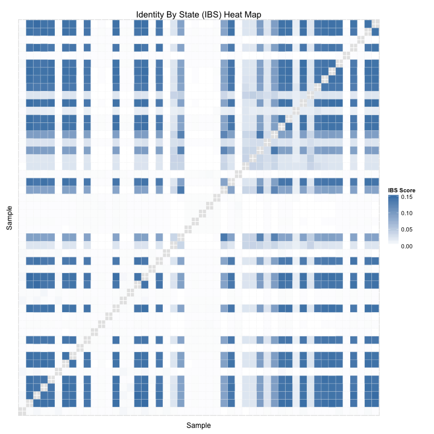

# Identity By State (IBS) for 1000 Genomes BRCA1


The input IBS matrix is an N^2 * 3 matrix, where N is the size of the population
and each row represents the IBS score for a pair of individuals.


```r
library(reshape2)
ibsPairs <- read.table(file=ibsFilename, stringsAsFactors=FALSE)
colnames(ibsPairs) <- c("sample1", "sample2", "ibsScore")
```

Make the IBS matrix symmetric.


```r
ibsPairsMirrored <- data.frame(sample1=ibsPairs$sample2,
                               sample2=ibsPairs$sample1,
                               ibsScore=ibsPairs$ibsScore)
ibsPairs <- rbind(ibsPairs, ibsPairsMirrored)
write.table(ibsPairs, file=symmetricIBSFilename)
```

Extract the IBS matrix for a random sample of the individuals.


```r
individuals <- unique(ibsPairs$sample1)
sampleSize <- 50
sample <- sample(individuals, sampleSize)
ibsPairs <- subset(ibsPairs, ibsPairs$sample1 %in% sample)
ibsPairs <- subset(ibsPairs, ibsPairs$sample2 %in% sample)
```

Exclude the IBS values for a genome and itself, because those values are always
1.0 and skew the heat map.


```r
ibsPairs <- subset(ibsPairs, ibsPairs$sample1 != ibsPairs$sample2)
```

Draw a heat map based on the IBS scores.


```r
require(ggplot2)
p <- ggplot(data=ibsPairs, aes(x=sample1, y=sample2)) +
     theme(axis.ticks=element_blank(), axis.text=element_blank()) +
     geom_tile(aes(fill=ibsScore), colour="white") +
     scale_fill_gradient(low="white", high="steelblue", na.value="black",
                         guide=guide_colourbar(title="IBS Score")) +
     labs(list(title="Identity By State (IBS) Heat Map", x="Sample", y="Sample"))
p
```



