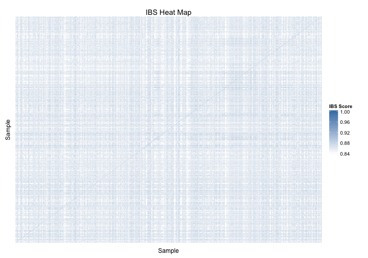

# Identity By State (IBS) for 1000 Genomes BRAC1


The input IBS matrix is an $N^2\times 3$ matrix, where $N$ is the size of the
population and each row represents the IBS score for a pair of individuals.


```r
library(reshape2)
ibs_pairs <- read.table("./1000genomes_phase1_brca1.ibs", header=FALSE,
                       stringsAsFactors=FALSE)
colnames(ibs_pairs) <- c("sample1", "sample2", "ibs_score")
```

Then, draw a heat map based on the IBS scores.


```r
require(ggplot2)
p <- ggplot(data=ibs_pairs, aes(x=sample1, y=sample2)) +
     theme(axis.ticks=element_blank(), axis.text=element_blank()) +
     geom_tile(aes(fill=ibs_score), colour="white") +
     scale_fill_gradient(low="white", high="steelblue",
                         guide=guide_colourbar(title="IBS Score")) +
     labs(list(title="IBS Heat Map", x="Sample", y="Sample"))
p
```



