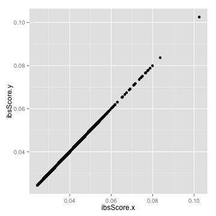

<!-- Copyright 2014 Google Inc. All rights reserved. -->

<!-- Licensed under the Apache License, Version 2.0 (the "License"); -->
<!-- you may not use this file except in compliance with the License. -->
<!-- You may obtain a copy of the License at -->

<!--     http://www.apache.org/licenses/LICENSE-2.0 -->

<!-- Unless required by applicable law or agreed to in writing, software -->
<!-- distributed under the License is distributed on an "AS IS" BASIS, -->
<!-- WITHOUT WARRANTIES OR CONDITIONS OF ANY KIND, either express or implied. -->
<!-- See the License for the specific language governing permissions and -->
<!-- limitations under the License. -->

# Identity By State (IBS) for 1000 Genomes Chromosome 22

The following example makes use of [1000
Genomes](https://cloud.google.com/genomics/data/1000-genomes). For more detail
about how this data was loaded into the Google Genomics API, please see [Google
Genomics Public Data](https://cloud.google.com/genomics/data/1000-genomes).


## Computing IBS

Follow the instructions at [README.rst](../../../README.rst) to compute the
Identity By State (IBS) scores for chr 22 of the [1000 Genomes data
set](https://cloud.google.com/genomics/data/1000-genomes). Specifically, first
configure and run the IBS DataFlow pipeline:

```sh
    java -cp ../../../target/googlegenomics-dataflow-java-v1beta2.jar \
    com.google.cloud.genomics.dataflow.pipelines.IdentityByState \
    --runner=BlockingDataflowPipelineRunner \
    --project=my-project-id \
    --stagingLocation=gs://my-bucket/staging \
    --output=gs://my-bucket/output/ibs.tsv \
    --numWorkers=40 \
    --references=22:16050407:51243297
```

We used the following BigQuery command to compute the reference bounds in the
above command:

```sql
    select min(start) as start, max(end) as end
    from [genomics-public-data:1000_genomes.variants]
    where reference_name IN ("22")
    limit 10;
```

Next, merge the generated
[`1000genomes_chr22_ibs.tsv`](1000genomes_chr22_ibs.tsv) shards into a single
file:

```sh
    gsutil ls gs://my-bucket/output/ | sort | \
    xargs -I {} gsutil cat {} >> 1000genomes_chr22_ibs.tsv
```

Finally, run [`generate.R`](generate.R) to visualize
[`1000genomes_chr22_ibs.tsv`](1000genomes_chr22_ibs.tsv) and compare it with
[the IBS scores computed by
PLINK/SEQ](https://raw.githubusercontent.com/deflaux/codelabs/qc-codelab/R/1000Genomes-BRCA1-analysis/data/plinkseqIBS/chr22/ALL.chr22.integrated_phase1_v3.20101123.snps_indels_svs.genotypes.ibs).

## Loading IBS Data in R

`ibsFilename1` contains an N^2 x 3 IBS matrix, where N is the size of the
population and each row represents the IBS score for a pair of individuals.


```r
ibsFilename1="1000genomes_chr22_ibs.tsv"
```

`ibsFilename2` contains an NxN IBS matrix, where N is the size of the population
and each cell of the matrix contains the IBS score of a pair of individuals.


```r
ibsURL2=
  paste("https://raw.githubusercontent.com/deflaux/codelabs/qc-codelab/R",
        "1000Genomes-BRCA1-analysis/data/plinkseqIBS/chr22",
        "ALL.chr22.integrated_phase1_v3.20101123.snps_indels_svs.genotypes.ibs",
        sep="/")
ibsFilename2="1000genomes_phase1_chr22_plinkseq_ibs.tsv"
download.file(ibsURL2, destfile=ibsFilename2, method="curl")
```

Check that the input files exist as expected.


```r
CheckFileExists <- function(filename) {
  if (file.exists(filename) == FALSE) {
    stop(paste(filename, "does not exist.", sep=" "))
  }
}
CheckFileExists(ibsFilename1)
CheckFileExists(ibsFilename2)
```


```r
library(reshape2)
ReadIBSFile <- function(ibsFilename, header=FALSE, rowNames=NULL) {
  ibsData <- read.table(file=ibsFilename, header=header,
                        row.names=rowNames, stringsAsFactors=FALSE)
  return (ibsData)
}
ibsData1 <- ReadIBSFile(ibsFilename1)
ibsData2 <- ReadIBSFile(ibsFilename2, header=TRUE, rowNames=1)
```

Transform the NxN matrix into a N^2 x 3 matrix, where each row represents the
IBS score for a pair of individuals.


```r
ibsData2 <- melt(data.matrix(ibsData2))
```

Set the column names of the two sets of IBS data consistently.


```r
ColumnNames <- function(ibsData) {
  colnames(ibsData) <- c("sample1", "sample2", "ibsScore")
}
colnames(ibsData1) <- ColumnNames(ibsData1)
colnames(ibsData2) <- ColumnNames(ibsData2)
```

Make the IBS matrix symmetric.


```r
MakeIBSDataSymmetric <- function(ibsData) {
  ibsPairsMirrored <- data.frame(sample1=ibsData$sample2,
                                 sample2=ibsData$sample1,
                                 ibsScore=ibsData$ibsScore)
  ibsData <- rbind(ibsData, ibsPairsMirrored)
}
ibsData1 <- MakeIBSDataSymmetric(ibsData1)
```

## IBS Heat Map

Exclude the IBS values for a genome and itself, because those values are always
1.0 and skew the heat map.


```r
ExcludeDiagonal <- function(ibsData) {
  ibsData <- subset(ibsData, ibsData$sample1 != ibsData$sample2)
  return (ibsData)
}
ibsData2Sample <- ExcludeDiagonal(ibsData2)
```

Extract the IBS matrix for a random sample of the individuals.


```r
SampleIBSMatrix <- function(ibsData) {
  individuals <- unique(ibsData$sample1)
  sampleSize <- 50
  sample <- sample(individuals, sampleSize)
  ibsData <- subset(ibsData, ibsData$sample1 %in% sample)
  ibsData <- subset(ibsData, ibsData$sample2 %in% sample)
  return (ibsData)
}
ibsData2Sample <- SampleIBSMatrix(ibsData2Sample)
```

Draw a heat map based on the sampled IBS scores.


```r
require(ggplot2)
DrawHeatMap <- function(ibsData) {
  p <- ggplot(data=ibsData, aes(x=sample1, y=sample2)) +
       theme(axis.ticks=element_blank(), axis.text=element_blank()) +
       geom_tile(aes(fill=ibsScore), colour="white") +
       scale_fill_gradient(low="white", high="steelblue", na.value="black",
                           guide=guide_colourbar(title= "IBS Score")) +
       labs(list(title="Identity By State (IBS) Heat Map",
                 x="Sample", y="Sample"))
  p
}
DrawHeatMap(ibsData2Sample)
```


## Comparison with [PLINK/SEQ](https://atgu.mgh.harvard.edu/plinkseq/) IBS

Compare the IBS matrix generated by DataFlow with [the one generated by
PLINK/SEQ](https://raw.githubusercontent.com/deflaux/codelabs/qc-codelab/R/1000Genomes-BRCA1-analysis/data/plinkseqIBS/chr22/ALL.chr22.integrated_phase1_v3.20101123.snps_indels_svs.genotypes.ibs)
and report the number of differences.


```r
mergedIBS <- merge(ibsData1, ibsData2, by = c(colnames(ibsData1)[1:2]))
diffIBS <- abs(mergedIBS$ibsScore.x - mergedIBS$ibsScore.y) < 1e-6
mergedDiffIBS <- cbind(mergedIBS, diffIBS)
colnames(mergedDiffIBS) <- c(colnames(mergedDiffIBS)[1:4], "almostEqualIBS")
nrow(mergedDiffIBS[mergedDiffIBS$almostEqualIBS == FALSE,])
```

```
[1] 7340
```

Plot the two IBS matrices to show their linear relationship.


```r
ggplot(mergedIBS, aes(x=ibsScore.x, y=ibsScore.y)) + geom_point()
```




```r
model <- lm(ibsScore.y ~ ibsScore.x, mergedIBS)
summary(model)
```

```

Call:
lm(formula = ibsScore.y ~ ibsScore.x, data = mergedIBS)

Residuals:
       Min         1Q     Median         3Q        Max 
-8.160e-06 -1.350e-08  1.720e-08  4.800e-08  5.301e-07 

Coefficients:
             Estimate Std. Error   t value Pr(>|t|)    
(Intercept) 2.734e-07  3.799e-10 7.198e+02   <2e-16 ***
ibsScore.x  1.000e+00  6.805e-09 1.470e+08   <2e-16 ***
---
Signif. codes:  0 '***' 0.001 '**' 0.01 '*' 0.05 '.' 0.1 ' ' 1

Residual standard error: 3.083e-07 on 1193554 degrees of freedom
Multiple R-squared:      1,	Adjusted R-squared:      1 
F-statistic: 2.16e+16 on 1 and 1193554 DF,  p-value: < 2.2e-16
```

