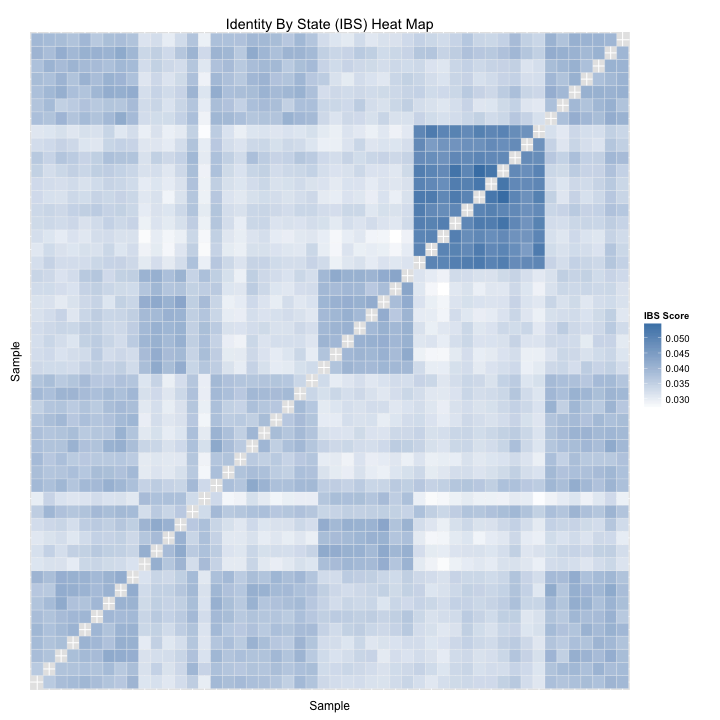

<!-- Copyright 2014 Google Inc. All rights reserved. -->

<!-- Licensed under the Apache License, Version 2.0 (the "License"); -->
<!-- you may not use this file except in compliance with the License. -->
<!-- You may obtain a copy of the License at -->

<!--     http://www.apache.org/licenses/LICENSE-2.0 -->

<!-- Unless required by applicable law or agreed to in writing, software -->
<!-- distributed under the License is distributed on an "AS IS" BASIS, -->
<!-- WITHOUT WARRANTIES OR CONDITIONS OF ANY KIND, either express or implied. -->
<!-- See the License for the specific language governing permissions and -->
<!-- limitations under the License. -->

# Identity By State (IBS) for 1000 Genomes Chromosome 22

The following example makes use of [1000
Genomes](https://cloud.google.com/genomics/data/1000-genomes). For more detail
about how this data was loaded into the Google Genomics API, please see [Google
Genomics Public Data](https://cloud.google.com/genomics/data/1000-genomes).


## Computing IBS

Follow the instructions at [README.rst](../../../README.rst) to compute the
Identity By State (IBS) scores for chr 22 of the [1000 Genomes data
set](https://cloud.google.com/genomics/data/1000-genomes). Specifically, first
configure and run the IBS DataFlow pipeline:

```sh
    java -cp ../../../target/google-genomics-dataflow-v1beta2-0.2-SNAPSHOT.jar \
    com.google.cloud.genomics.dataflow.pipelines.IdentityByState \
    --runner=BlockingDataflowPipelineRunner \
    --project=my-project-id \
    --stagingLocation=gs://my-bucket/staging \
    --output=gs://my-bucket/output/ibs.tsv \
    --numWorkers=40 \
    --references=22:16050407:51243297
```

We used the following BigQuery command to compute the reference bounds in the
above command:

```sql
SELECT
  MIN(start) AS start,
  MAX(end) AS end
FROM
  [genomics-public-data:1000_genomes.variants]
WHERE
  reference_name IN ("22")
  ```

Next, merge the generated
[`1000genomes_chr22_ibs.tsv`](1000genomes_chr22_ibs.tsv) shards into a single
file:

```sh
    gsutil cat gs://my-bucket/output/is.tsv* | sort > 1000genomes_chr22_ibs.tsv
```

Finally, run [`generate.R`](generate.R) to visualize
[`1000genomes_chr22_ibs.tsv`](1000genomes_chr22_ibs.tsv) and compare it with
[the IBS scores computed by
PLINK/SEQ](https://raw.githubusercontent.com/deflaux/codelabs/qc-codelab/R/1000Genomes-BRCA1-analysis/data/plinkseqIBS/chr22/ALL.chr22.integrated_phase1_v3.20101123.snps_indels_svs.genotypes.ibs).

## Loading IBS Data in R

`ibsDataFlowFilename` contains an N^2 x 3 IBS matrix, where N is the size of the
population and each row represents the IBS score for a pair of individuals.


```r
ibsDataFlowFilename="1000genomes_chr22_ibs.tsv"
```

`ibsPlinkSeqFilename` contains an NxN IBS matrix, where N is the size of the population
and each cell of the matrix contains the IBS score of a pair of individuals.


```r
ibsPlinkSeqFilename="1000genomes_phase1_chr22_plinkseq_ibs.tsv"
```


```r
require(reshape2)
require(dplyr)

ReadIBSFile <- function(ibsFilename, header=FALSE, rowNames=NULL) {
  ibsData <- read.table(file=ibsFilename, header=header,
                        row.names=rowNames, stringsAsFactors=FALSE)
  return (ibsData)
}
ibsDataflowData <- ReadIBSFile(ibsDataFlowFilename)
ibsPlinkSeqData <- ReadIBSFile(ibsPlinkSeqFilename, header=TRUE, rowNames=1)
```

Transform the NxN matrix into a N^2 x 3 matrix, where each row represents the
IBS score for a pair of individuals.


```r
ibsPlinkSeqData <- melt(data.matrix(ibsPlinkSeqData))
```

Set the column names of the two sets of IBS data consistently.


```r
ColumnNames <- function(ibsData) { 
  if(3 == ncol(ibsData)) {
    colnames(ibsData) <- c("sample1", "sample2", "ibsScore")
  } else {
    colnames(ibsData) <- c("sample1", "sample2", "ibsScore", "similar", "observed")
  }
}
colnames(ibsDataflowData) <- ColumnNames(ibsDataflowData)
colnames(ibsPlinkSeqData) <- ColumnNames(ibsPlinkSeqData)
```

Make the IBS matrix symmetric.


```r
MakeIBSDataSymmetric <- function(ibsData) {
  ibsPairsMirrored <- data.frame(sample1=ibsData$sample2,
                                 sample2=ibsData$sample1,
                                 ibsScore=ibsData$ibsScore)
  ibsData <- rbind(ibsData[,1:3], ibsPairsMirrored)
}
ibsDataflowData <- MakeIBSDataSymmetric(ibsDataflowData)
```

## IBS Heat Map

Exclude the IBS values for a genome and itself, because those values are always
1.0 and skew the heat map.


```r
ExcludeDiagonal <- function(ibsData) {
  ibsData <- filter(ibsData, ibsData$sample1 != ibsData$sample2)
  return (ibsData)
}
ibsPlinkSeqDataSample <- ExcludeDiagonal(ibsPlinkSeqData)
```

Extract the IBS matrix for a random sample of the individuals.


```r
SampleIBSMatrix <- function(ibsData, sampleSize=50) {
  individuals <- unique(ibsData$sample1)
  sample <- sample(individuals, sampleSize)
  ibsData <- subset(ibsData, ibsData$sample1 %in% sample)
  ibsData <- subset(ibsData, ibsData$sample2 %in% sample)
  return (ibsData)
}
ibsPlinkSeqDataSample <- SampleIBSMatrix(ibsPlinkSeqDataSample)
```

Draw a heat map based on the sampled IBS scores.


```r
require(ggplot2)
DrawHeatMap <- function(ibsData) {
  p <- ggplot(data=ibsData, aes(x=sample1, y=sample2)) +
       theme(axis.ticks=element_blank(), axis.text=element_blank()) +
       geom_tile(aes(fill=ibsScore), colour="white") +
       scale_fill_gradient(low="white", high="steelblue", na.value="black",
                           guide=guide_colourbar(title= "IBS Score")) +
       labs(list(title="Identity By State (IBS) Heat Map",
                 x="Sample", y="Sample"))
  p
}
DrawHeatMap(ibsPlinkSeqDataSample)
```



## Comparison with [PLINK/SEQ](https://atgu.mgh.harvard.edu/plinkseq/) IBS

Compare the IBS matrix generated by DataFlow with [the one generated by
PLINK/SEQ](https://raw.githubusercontent.com/deflaux/codelabs/qc-codelab/R/1000Genomes-BRCA1-analysis/data/plinkseqIBS/chr22/ALL.chr22.integrated_phase1_v3.20101123.snps_indels_svs.genotypes.ibs)
and report the number of differences.


```r
mergedIBS <- inner_join(ExcludeDiagonal(ibsDataflowData),
                        ExcludeDiagonal(ibsPlinkSeqData),
                        by = c(colnames(ibsDataflowData)[1:2]))
mergedDiffIBS <- mutate(mergedIBS, 
                        almostEqualIBS = abs(mergedIBS$ibsScore.x - mergedIBS$ibsScore.y) < 1e-5)
nrow(mergedDiffIBS[mergedDiffIBS$almostEqualIBS == FALSE,])
```

```
[1] 1032
```

Plot the two IBS matrices to show their linear relationship.


```r
ggplot(mergedIBS, aes(x=ibsScore.x, y=ibsScore.y)) + geom_point()
```


```r
model <- lm(ibsScore.y ~ ibsScore.x, mergedIBS)
summary(model)
```

```

Call:
lm(formula = ibsScore.y ~ ibsScore.x, data = mergedIBS)

Residuals:
       Min         1Q     Median         3Q        Max 
-1.908e-05 -9.064e-07 -8.521e-07  1.116e-06  1.207e-06 

Coefficients:
              Estimate Std. Error   t value Pr(>|t|)    
(Intercept) -1.266e-06  8.181e-09    -154.8   <2e-16 ***
ibsScore.x   1.000e+00  2.279e-07 4388578.9   <2e-16 ***
---
Signif. codes:  0 '***' 0.001 '**' 0.01 '*' 0.05 '.' 0.1 ' ' 1

Residual standard error: 1.136e-06 on 1191370 degrees of freedom
Multiple R-squared:      1,	Adjusted R-squared:      1 
F-statistic: 1.926e+13 on 1 and 1191370 DF,  p-value: < 2.2e-16
```

Comparison of IBS Results to Pedigree
===================================================

First we fetch the pedigree information from the 1,000 Genomes project.

```r
pedigree <- read.delim("ftp://ftp.1000genomes.ebi.ac.uk/vol1/ftp/technical/working/20130606_sample_info/20130606_g1k.ped", as.is=TRUE)
summary(pedigree)
```

```
  Family.ID         Individual.ID      Paternal.ID       
 Length:3501        Length:3501        Length:3501       
 Class :character   Class :character   Class :character  
 Mode  :character   Mode  :character   Mode  :character  
                                                         
                                                         
                                                         
 Maternal.ID            Gender        Phenotype  Population       
 Length:3501        Min.   :1.000   Min.   :0   Length:3501       
 Class :character   1st Qu.:1.000   1st Qu.:0   Class :character  
 Mode  :character   Median :2.000   Median :0   Mode  :character  
                    Mean   :1.503   Mean   :0                     
                    3rd Qu.:2.000   3rd Qu.:0                     
                    Max.   :2.000   Max.   :0                     
 Relationship         Siblings         Second.Order      
 Length:3501        Length:3501        Length:3501       
 Class :character   Class :character   Class :character  
 Mode  :character   Mode  :character   Mode  :character  
                                                         
                                                         
                                                         
 Third.Order        Other.Comments    
 Length:3501        Length:3501       
 Class :character   Class :character  
 Mode  :character   Mode  :character  
                                      
                                      
                                      
```

We add the population and family identifiers to each individual in our pair.

```r
ibs_sample1_ped <- inner_join(ExcludeDiagonal(ibsDataflowData),
                              select(pedigree, Individual.ID, Family.ID, Population),
                              by=c("sample1" = "Individual.ID"))
ibs_both_ped <- inner_join(ibs_sample1_ped,
                           select(pedigree, Individual.ID, Family.ID, Population),
                           by=c("sample2" = "Individual.ID"))
ibs_relationship <- mutate(ibs_both_ped,
                           relationship=ifelse(Family.ID.x == Family.ID.y,
                                               "Same Family",
                                               ifelse(Population.x == Population.y,
                                                      "Same Population",
                                                      "None")))
```

And plot the scores for pairs by their relationship type:

```r
boxplot(ibsScore~relationship, data=ibs_relationship, main="Identity By State Results compared to Pedigree", 
    xlab="Relationship Type Between the Pair of Individuals", ylab="Identity By State Score")
```


